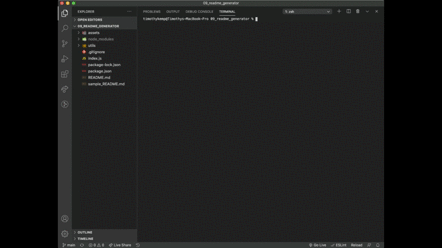

# 09_readme_generator

## Description

This application is a README Generator that can be used by running the CLI within the terminal. It is built using Node.js and uses the Inquirer package to present questions about the user's project. The answers are then exported as a formatted README file for use within the project's repository.

-----

## Table of Contents

* [Installation](#installation)
* [Usage](#usage)
* [Videos](#videos)
* [License](#license)
* [Contributing](#contributing)
* [Tests](#tests)
* [Questions](#questions)

-----

## Installation

From the application's root folder, run the command `npm install` followed by `node index.js` in the terminal.

-----

## Usage

When it comes time to create a README for your project, run this program to ensure you have included all of the standard sections within the README file. For each question presented within the application, either provide a typed answer, or select from a list of options before hitting 'return' to move to the next question. Once all questions have been answered, a file called 'generated_README' will be written to the root folder of this application. The file can be renamed and moved as needed.

-----

## Videos

To watch a video demonstrating the full functionality of this application, click on the following link:

[README Generator Demo Video](https://drive.google.com/file/d/197W6_kaPPxFe_pOWg9K3FGI8j35as9J-/view?usp=sharing)

The following GIF is an abbreviated version of the demo video above:

-----

## License

This project does not have a license.

-----

## Contributing

This application was part of a homework assignment, and it does not need any further contributions.

-----

## Tests

There are no tests needed for this project.

-----

## Questions

If you have any questions about this project, please free to contact me through my [Github profile](https://github.com/timothykemp) or via [email](mailto:timothymichaelkemp@gmail.com).
  